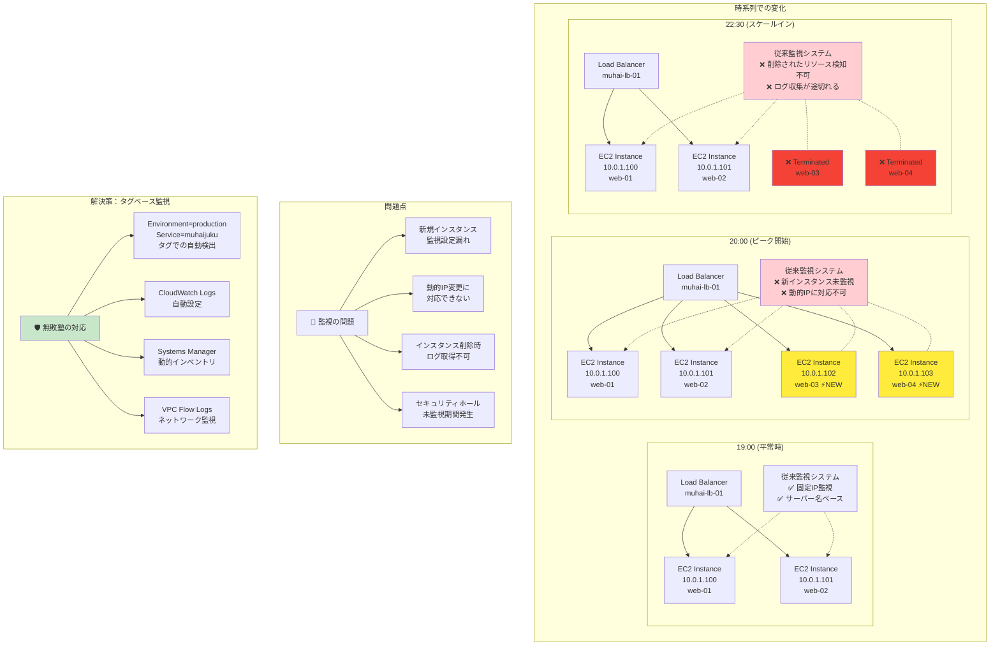
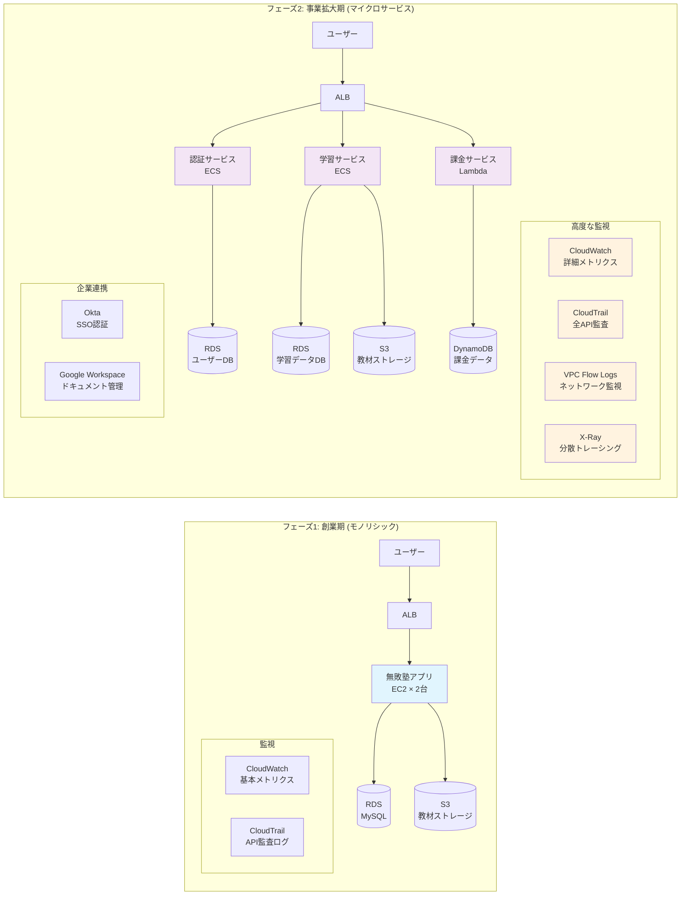
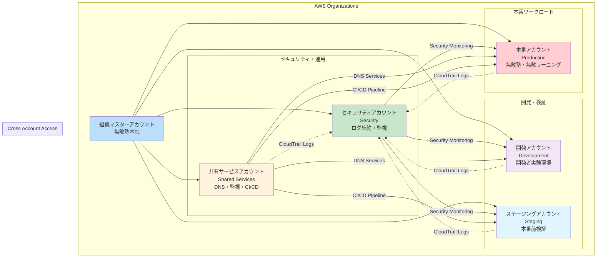
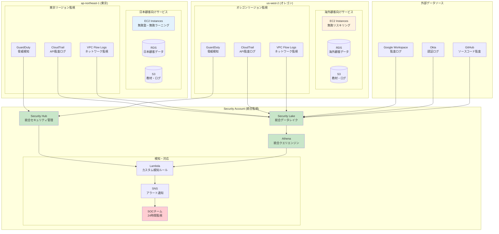

# クラウド環境の特徴とセキュリティ課題

## 🌐 クラウド環境におけるセキュリティ対策のポイント

従来のオンプレミス環境ではコンピューティング環境に対してすべての責任を持っていましたが、クラウド環境では、プロバイダーと利用者の責任が分かれているのが特徴です。自分たちの責任範囲を正しく理解し、対策を考える必要があります。

### 責任共有モデルの概要

| サービス層 | 代表的なサービス | プロバイダー責任 | 利用者責任 |
|-----------|------------------|------------------|-------------|
| **IaaS** (Infrastructure as a Service) | AWS EC2 Azure Virtual Machines GCP Compute Engine | ✅ 物理データセンター ✅ ネットワークインフラ ✅ ホストOS・ハイパーバイザー ✅ 物理的な分離・隔離 | ❗ ゲストOS（パッチ管理・設定） ❗ アプリケーション ❗ データ保護 ❗ ネットワーク設定 ❗ ID・アクセス管理 |
| **PaaS** (Platform as a Service) | AWS RDS Azure App Service GCP Cloud SQL | ✅ IaaS層の全責任 ✅ OSパッチ管理 ✅ ランタイム環境 ✅ プラットフォームセキュリティ | ❗ アプリケーションコード ❗ データ分類・保護 ❗ ユーザー認証・認可 ❗ ネットワークトラフィック制御 |
| **SaaS** (Software as a Service) | Microsoft 365 Google Workspace Salesforce | ✅ アプリケーション全体 ✅ インフラ・プラットフォーム ✅ データセンター物理セキュリティ ✅ 基本的なデータ保護 | ❗ ユーザー管理・権限設定 ❗ データ分類・ラベリング ❗ 不正使用の検知・対応 ❗ コンプライアンス設定 |

**重要ポイント**: 上位レイヤーほどプロバイダー責任が拡大するが、セキュリティ設定は常に利用者責任

### よくある誤解と現実

| よくある誤解 | 現実 | 無敗塾での実践的な対応策 |
|-------------|------|----------------------|
| 「クラウドプロバイダーがセキュリティを担保してくれる」 | プロバイダーは物理層のみ責任 | **フェーズ1**: 自社責任範囲の明確化、AWS Well-Architected Framework活用 **フェーズ2**: セキュリティチェックリスト作成、定期監査 |
| 「マネージドサービスは設定不要」 | 基本設定のみ。セキュリティ設定は利用者責任 | **無敗ラーニング展開時**: RDS、S3の暗号化設定、IAMポリシー見直し |
| 「Auto Scalingで自動的に安全」 | スケールアウト時の監視設定が困難 | **SREチーム対応**: CloudWatch Logsの動的設定、タグベース監視 |

*Auto Scalingでインスタンスが増減する様子と、従来の固定監視では対応困難な状況を図示*

### クラウドとオンプレミスの最大の違いは動的リソースと拡張性

クラウド環境では以下の特徴により、従来のセキュリティ監視手法では対応困難な課題が発生します：

- **リソースの動的変化**: Auto Scaling、コンテナ、サーバーレスによる一時的リソース
- **責任境界外の対策**: マネージドサービスを賢く使う必要性
- **マルチアカウント・マルチリージョン環境の複雑性**: 分散環境での統合管理

## 🏫 無敗塾ケーススタディ：成長段階とセキュリティ課題

### フェーズ1（創業期）: 小規模チームでのクラウド基盤選択とセキュリティ課題

**ビジネス状況**
- 学生向け学習サービス「無敗塾」を立ち上げ
- 開発チームは小規模、クラウド基盤にはAWSを利用
- シンプルなログイン認証を導入（パスキー認証を採用）
- モノリシックなアーキテクチャで構成

**セキュリティ課題**
- **限られたリソース**: セキュリティ専任者なし、開発者が兼務
- **基本設定の見落とし**: AWS IAMの過剰権限、パブリックS3バケット
- **監視の手薄さ**: ログは保存されているが、定期的な確認ができていない

### フェーズ2（事業拡大期）: マイクロサービス化・SREチーム発足での監視課題拡大

**ビジネス状況**
- 社会人向け「無敗ラーニング」を立ち上げ
- 企業契約が増加し、法人向けシングルサインオン（SSO）対応が必要
- インフラSREチームを発足、マイクロサービス化を実施
- 小規模(2-3名)のセキュリティ担当者を配置

**監視課題の拡大**
- **システム複雑化**: マイクロサービス間の通信監視
- **ログの分散**: 複数サービスからの大量ログデータ
- **企業顧客対応**: より厳格なセキュリティ要件への対応

*フェーズ1のモノリス → フェーズ2のマイクロサービス化の変遷を図示*

### 主要課題と無敗塾での対応事例

**1. リソースの動的変化への対応**

**課題**: Auto Scaling、コンテナ、サーバーレスによる一時的リソース
- 無敗塾では学習ピーク時間（19-22時）にEC2インスタンスが自動増加
- 従来の固定IP・サーバー名ベースの監視が機能しない

**無敗塾での解決策**:
- **タグベース監視**: `Environment=production`, `Service=muhaijuku` タグでの統合監視
- **動的アセット発見**: AWS Systems Manager Inventoryでの自動リソース発見
- **ログ集約**: CloudWatch Logsでの自動ログ収集設定

**2. セキュリティ境界の複雑化**

**課題**: マイクロサービス間の複雑な通信パス
- 無敗ラーニング追加で認証サービス、学習進捗サービス、課金サービスが分離
- 攻撃の横展開が追跡困難

**無敗塾での解決策**:
- **サービスメッシュ導入**: AWS App Meshでの通信制御
- **VPC Flow Logs**: マイクロサービス間通信の可視化
- **セキュリティグループ最小権限**: 必要最小限の通信のみ許可

**3. 設定管理の困難さ**

**課題**: Infrastructure as Code（IaC）による自動化と設定ドリフト
- Terraformでのインフラ管理開始により、手動変更との乖離発生
- 意図しない設定変更が本番環境に展開されるリスク

**無敗塾での解決策**:
- **AWS Config**: 設定変更の継続的監視
- **Terraform Planの義務化**: Pull Request時の事前確認
- **GitOps**: GitHubでの承認フローを経た変更のみ適用

## マルチアカウント・マルチリージョン環境の複雑性

### 無敗塾での環境分散管理

**フェーズ2以降のアカウント戦略**

無敗塾では事業拡大に伴い、以下のようなマルチアカウント戦略を採用しました：

- **本番アカウント**: 無敗塾・無敗ラーニングの本番環境
- **開発アカウント**: 開発者の実験・テスト環境  
- **ステージングアカウント**: 本番デプロイ前の検証環境
- **セキュリティアカウント**: ログ集約・監視専用アカウント
- **共有サービスアカウント**: DNS、監視等の共通基盤

*AWS Organizationsを使ったアカウント構成と、各アカウントの役割を図示*

### 運用上の主要課題と解決策

**課題1: ログ・権限・ネットワーク設定の複雑化**

**問題**: 各アカウントに分散したログを統合監視する必要がある
- CloudTrailログが各アカウントに分散
- 横断的なセキュリティ監視が困難
- インシデント発生時の調査に時間がかかる

**無敗塾での解決策**:
- **AWS Security Lake**: 全アカウントのログを集約
- **AWS Organizations**: アカウント横断での統一ポリシー適用  
- **Cross Account Role**: セキュリティチームが全アカウントにアクセス可能

**課題2: 災害対策・コンプライアンスによる地理的分散**

**問題**: 法人顧客要求により、データローカライゼーション対応が必要
- 企業顧客の要求でap-northeast-1（東京）とus-west-2（オレゴン）にデータ配置
- 各リージョンでの監視設定の統一が困難
- 異なるリージョン間でのログ形式の差異

**無敗塾での解決策**:
- **リージョン統一テンプレート**: Terraformでの設定標準化
- **Global Security Hub**: 全リージョンのセキュリティ状況を一元管理
- **リージョン横断ログ分析**: Amazon Athenaでの統合クエリ実行

*東京とオレゴンリージョンのリソースを、セキュリティアカウントで統合監視する構成を図示*

### 実践的な対策ポイント

**ログ集約の段階的実装**
1. **Phase 1**: CloudTrailの組織レベル有効化
2. **Phase 2**: Security Lakeでの統合データレイク構築  
3. **Phase 3**: カスタム検知ルールの横展開

**権限管理の標準化**
- **最小権限原則**: 各アカウントで必要最小限の権限のみ付与
- **定期的権限監査**: AWS Access Analyzerでの未使用権限検出
- **緊急時対応**: Break-glass roleでの緊急アクセス手順
