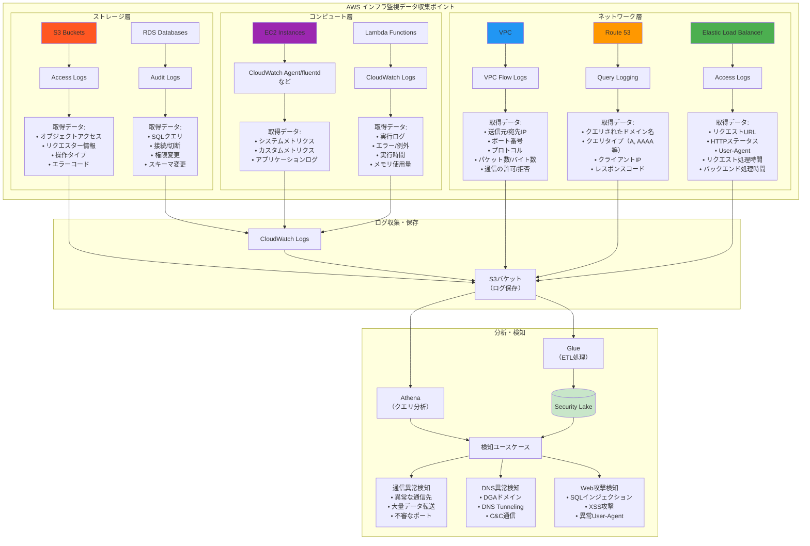

# クラウドセキュリティサービスとカスタム検知戦略

**時間：8:55-9:20 (25分)**

## 🛡️ クラウドプラットフォーム共通の監視関連セキュリティサービス

クラウドプラットフォームでは、様々なマネージドセキュリティサービスが提供されており、これらを組み合わせることで高度なセキュリティ対策が可能になります。しかし、汎用的なサービスだけでは組織固有の要件に対応できないため、カスタム検知戦略が重要となります。

また、セキュリティに限らず各種ログを収集するための仕組みも存在し、これらは監視だけでなく監査などの目的でも活用できます。

### 1. マネージド脅威検知サービス（GuardDuty, Security Command Center等）

📖 **AWS GuardDuty 検知例**: [GuardDuty findings samples](https://docs.aws.amazon.com/guardduty/latest/ug/guardduty_finding-types-retired.html)

#### 検知可能な脅威タイプ

**マルウェア検知**
- C&Cサーバー通信
- DGA（Domain Generation Algorithm）検知
- 暗号通貨マイニング通信
- ボットネット通信

**ネットワーク異常**
- 異常なデータ転送・リクエスト量

**不正アクセス**
- ブルートフォース攻撃
- 地理的異常アクセス

**ユーザ・アカウントの不審な振る舞い**
- 不審なリソースの操作やAPI呼び出し

#### ⚠️ 限界

- **汎用的な脅威のみ、組織固有ルール・ビジネスロジック依存の異常は検知不可**
  - 業務上想定された強い権限の操作、不審と見える操作の誤検知
  - 許可されていないリクエストの発生（設定ミス vs 攻撃前探索）
  - 部門を超えたデータアクセス（正当な業務 vs 情報窃取の判別不可）
  - 通常業務範囲内での異常パターン（営業データの大量ダウンロード等）
- **当該クラウド以外のデータは活用できない**
  - 複合的に検知するルールなどは運用不可
  - 必然的に、複数の検知サービスを使い分けることになってしまう

### 2. セキュリティ統合管理サービス（Security Hub, Security Command Center等）

📖 **AWS Security Hub findings形式**: [ASFF syntax](https://docs.aws.amazon.com/securityhub/latest/userguide/securityhub-findings-format-syntax.html)

#### セキュリティ状況の一元管理

**機能概要**
- **CSPM（Cloud Security Posture Management）**：セキュリティ設定の監視
- **多様なセキュリティツールの統合**: GuardDuty、Config、Inspector等の結果統合
- **統一ダッシュボード**: セキュリティ状況の可視化
- **AWS Security Finding Format (ASFF)**: 標準化フォーマットでの情報統合

#### コンプライアンスチェック自動化

**対応フレームワーク**
- **CIS Controls**: 基本的なセキュリティ設定チェック
- **PCI DSS**: 決済カード業界のコンプライアンス要件
- **SOC 2**: サービス組織統制レポート要件

#### **⚠️ 限界：定義済みルールベース、カスタムビジネスルール未対応**

- 組織固有のコンプライアンス要件（社内規程、業界固有ルール）
- ビジネス文脈を考慮した優先度付け（部門別重要度、業務影響度）
- 複合的な条件による高度な判定（時間+ユーザー+リソース+操作の組み合わせ）

また、Security Hub、SCCはチケット管理（担当者の割り当て、詳細なコメント履歴、チケットライフサイクル管理、複数人での協調作業機能）の機能は不十分のため、それらは別途用意する必要があります。

### 3. 監査ログ（CloudTrail, Cloud Logging等）

📖 **AWS CloudTrail ログ例**: [CloudTrail log file examples](https://docs.aws.amazon.com/awscloudtrail/latest/userguide/cloudtrail-log-file-examples.html)

#### API監査ログの網羅的収集

**収集対象**
- **管理イベント**: IAM操作、リソース作成・削除
- **データイベント**: S3オブジェクトアクセス、Lambda実行
- **認証イベント**: ユーザーログイン、権限変更

#### ✅ 活用例

**クラウド環境の状況把握の基礎**
- クラウドにたいする操作を把握するうえで最も重要な要素
- 特に理由がない限りは必ず取得するのがよい

**カスタム検知での活用例**
- 複合条件での検知（時間+ユーザー+リソース+操作）
- 組織固有のパターン学習
- ビジネスコンテキストを考慮した判定

### 4. 構成管理・アセット監視サービス（Config, Cloud Asset Inventory等）

📖 **AWS Config 設定変更記録例**: [Config configuration items](https://docs.aws.amazon.com/config/latest/developerguide/config-concepts.html#config-items)

#### 設定変更監視

- **リソース設定の追跡**: セキュリティグループ、IAMポリシー、ストレージ設定
- **変更検知**: 設定変更のリアルタイム検知・記録
- **変更履歴**: いつ・誰が・何を変更したかの追跡

#### アセットインベントリ：全リソースの可視化・棚卸し

- **リアルタイム一覧**: 全クラウドリソースの現在状況
- **タグベース管理**: 部門・プロジェクト別の分類
- **依存関係マッピング**: リソース間の関連性可視化

#### ✅ 活用例

**意図しない設定変更検知**
- 本番環境での危険な設定変更の即座検知
- 権限エスカレーション検知（管理者権限の追加等）
- コンプライアンス違反の自動検知（セキュリティ統合管理サービスと連携）

**設定内容の履歴追加**
- 設定情報は監査ログに残らない場合も多い
- 監査ログからスナップショットを追跡するのは困難

### 5. インフラ監視データの活用

各種インフラコンポーネントから取得可能なログと、その活用方法を以下に示します。

#### 主要なクラウドインフラログの取得と活用

**ネットワーク・通信系ログ**
- **ネットワークフローログ** (AWS: VPC Flow Logs, GCP: VPC Flow Logs, Azure: NSG Flow Logs): 通信パターン異常（異常な通信先、プロトコル、ボリューム）の検知
  - 📖 [VPC Flow Logs record examples](https://docs.aws.amazon.com/vpc/latest/userguide/flow-logs-records-examples.html)
- **DNSログ** (AWS: Route 53, GCP: Cloud DNS, Azure: Azure DNS): DNS異常（DGA、DNS Tunneling、C&C通信）の検知
  - 📖 [Route 53 query logging](https://docs.aws.amazon.com/Route53/latest/DeveloperGuide/query-logs.html)
- **ロードバランサーログ** (AWS: ELB, GCP: Cloud Load Balancing, Azure: Load Balancer): Web攻撃（SQLインジェクション、XSS、異常User-Agent）の検知
  - 📖 [ALB access log entries](https://docs.aws.amazon.com/elasticloadbalancing/latest/application/load-balancer-access-logs.html#access-log-entry-syntax)

**ストレージ・データアクセス系ログ**
- **オブジェクトストレージログ** (AWS: S3, GCP: Cloud Storage, Azure: Blob Storage): オブジェクトアクセス監視、不正ダウンロード検知
  - 📖 [S3 server access log format](https://docs.aws.amazon.com/AmazonS3/latest/userguide/LogFormat.html)
- **データベース監査ログ** (AWS: RDS, GCP: Cloud SQL, Azure: SQL Database): SQLクエリ監視、権限変更、スキーマ変更の追跡
  - 📖 [RDS database activity streams](https://docs.aws.amazon.com/AmazonRDS/latest/UserGuide/DBActivityStreams.html)
- **APIデータイベント** (AWS: CloudTrail Data Events, GCP: Data Access Logs, Azure: Resource Logs): データプレーンイベント監視
  - 📖 [CloudTrail data events](https://docs.aws.amazon.com/awscloudtrail/latest/userguide/logging-data-events-with-cloudtrail.html)

これらのログは各クラウドプラットフォームのストレージサービスやログ管理サービスに集約され、クエリ分析ツールやセキュリティ分析基盤での統合分析に活用されます。

### 📊 （まとめ）AWSにおける取得可能なログと取得の構成

## 🌐 プラットフォーム外から収集するべきデータ

クラウドネイティブなログだけでは、組織全体のセキュリティ状況を把握することはできません。プラットフォーム外のデータソースからの情報収集が重要です。

📖 **主要な外部サービスのログフォーマット例**:
- [Google Workspace Activity Events](https://developers.google.com/admin-sdk/reports/reference/rest/v1/activities)
- [Okta System Log API](https://developer.okta.com/docs/reference/api/system-log/)
- [GitHub Audit Log](https://docs.github.com/en/organizations/keeping-your-organization-secure/managing-security-settings-for-your-organization/reviewing-the-audit-log-for-your-organization)

### アプリケーションログ

**ビジネスロジック固有のイベント**: ユーザー行動、機能利用パターン
- 🏫 **無敗塾例**: 学習進捗、試験受験、成績閲覧、教材ダウンロード

**認証・認可ログ**: アプリレベルでの権限チェック、失敗試行
- アプリケーション独自の権限システム
- 多要素認証の詳細ログ

**データアクセスログ**: 個人情報、機密データへのアクセス記録
- データベース層でのアクセス制御
- ファイルレベルでのアクセス追跡

### 外部連携システムのログ

**ID管理基盤（Okta等）**: SSO認証、プロビジョニング、権限変更
- 🏫 **無敗塾例**: 企業SSO連携、講師管理システム、成績管理システム
- 📖 **ログ例**: [Okta Event Types](https://developer.okta.com/docs/reference/api/event-types/)

**決済システム**: 取引履歴、異常課金パターン
**外部API連携**: サードパーティサービスとのデータ交換

- 管理者など強い権限による変更の追跡
- 個人情報などセンシティブなデータを扱う場合の閲覧履歴

### SaaS・社内向けサービスログ

**Google Workspace**: ファイルアクセス、権限変更、共有設定
- 🏫 **無敗塾例**: 教材作成プロセス、開発ソースコード、学籍データ管理
- **重要**: アクセス成功だけでなく、`access_denied`ログも監視対象
- 📖 **ログ例**: [Google Drive Activity API](https://developers.google.com/drive/activity/v2/reference/rest/v2/activity)

**GitHub**: コード変更、アクセス制御、リポジトリ操作
- ソースコードの不正ダウンロード監査
- 権限変更の監視
- 📖 **ログ例**: [GitHub Audit Log Events](https://docs.github.com/en/enterprise-cloud@latest/admin/monitoring-activity-in-your-enterprise/reviewing-audit-logs-for-your-enterprise/audit-log-events-for-your-enterprise)

**Slack/Teams**: 機密情報の共有、ファイル送信
- 機密データの誤送信検知
- 機密データの閲覧記録確認
- 📖 **ログ例**: [Slack Audit Logs API](https://api.slack.com/admins/audit-logs)

### エンドポイント・デバイスログ

**MDM（Mobile Device Management）**: デバイス管理、アプリインストール
- 🏫 **無敗塾例**: 講師・職員の業務端末、試験監督用デバイス
- 📖 **例**: [Microsoft Intune device compliance](https://learn.microsoft.com/en-us/mem/intune/protect/device-compliance-get-started)

**EDR（Endpoint Detection and Response）**: ファイル操作、プロセス実行
- 不正なファイル操作の検知
- マルウェア実行の早期発見
- 📖 **例**: [CrowdStrike Falcon Data Replicator](https://www.crowdstrike.com/wp-content/uploads/2022/03/crowdstrike-falcon-data-replicator-guide-v3.pdf)

### オフィスネットワーク・物理セキュリティログ

**ファイアウォール・プロキシログ**: 外部通信、Webアクセス制御
- 危険サイトへのアクセス試行
- データ流出の可能性がある大量通信

**無線LAN（Wi-Fi）ログ**: デバイス接続、認証失敗、不正AP検知
- 未許可デバイスの接続試行
- 不正アクセスポイントの検知

**VPN接続ログ**: リモートアクセス、接続元地域、異常接続パターン
- 地理的に異常な接続の検知
- 時間外アクセスの監視

**入退室管理システム**: 物理アクセス、時間外入室、共連れ検知
- 🏫 **無敗塾例**: 講師控室アクセス、サーバールーム入退室、学生の施設利用

## 🎯 カスタム検知が必要な実例とビジネスケース

マネージドセキュリティサービスでは検知困難だが、カスタム検知で対応可能な実例を無敗塾のケーススタディで解説します。

### (1) 無敗ラーニング拡大期、夜間に管理者が大量の学習データをダウンロード

- **GuardDuty判定**: ✅ 正常 → 正当な認証情報使用（正規の管理者アカウント）
- **カスタム検知**: ⚠️ アラート → 業務時間外 + 特権アカウント + データ量閾値 = アラート

**検知ロジックの詳細**
- **時間条件**: 業務時間外（21:00-8:00）のアクセス
- **権限条件**: データベース管理者権限でのダイレクトアクセス
- **データ量**: 通常の10倍を超える学習データダウンロード
- **ユーザー属性**: 通常は夜間作業をしない管理者

**無敗塾での教訓**: 正当な権限を持つ内部者による不正は、マネージドサービスでは検知が困難

### (2) 講師アカウントが試験期間外に成績データへ大量アクセス

- **Security Hub判定**: ✅ 権限は正しく設定 → 講師として適切な権限、コンプライアンスチェック通過
- **カスタム検知**: ⚠️ FERPA違反リスク検知 → 役職 + 時期 + アクセスパターン = アラート

**検知ロジックの詳細**
- **役職条件**: 講師アカウントによる成績データアクセス
- **時期条件**: 試験期間外（成績入力期間以外）
- **パターン条件**: 複数クラスの成績データを短時間で大量アクセス
- **法規制考慮**: FERPA（米国教育プライバシー法）の要件

### (3) VPN機器の脆弱性を悪用して内部ネットワークに侵入、内部向けのシステムに侵入してからのVPC内探索

- **GuardDuty判定**: ✅ 内部通信のため検知せず
- **VPN機器**: ✅ exploit時のログ記録なし
- **カスタム検知**: ⚠️ 内部偵察・データ収集検知
  - サーバー群への順次接続 + ファイル共有大量アクセス = アラート

**複合的検知ロジック**
- **ネットワーク異常**: 異常ポートへの通信の発生
- **アクセスパターン**: 業務時間内だが通常アクセスしないサーバー群への順次接続
- **データアクセス**: ファイル共有への異常な大量アクセス
- **時系列相関**: 短時間での複数システム探索行動

## 📝 まとめ

クラウドプラットフォームが提供するマネージドセキュリティサービスは汎用的な脅威検知には優れていますが、組織固有のビジネスロジックや内部者による不正など、文脈を考慮した検知には限界があります。効果的なセキュリティ監視には、クラウド内外の多様なログソースを統合し、組織の業務パターンやコンプライアンス要件に合わせたカスタム検知ルールの実装が不可欠です。
