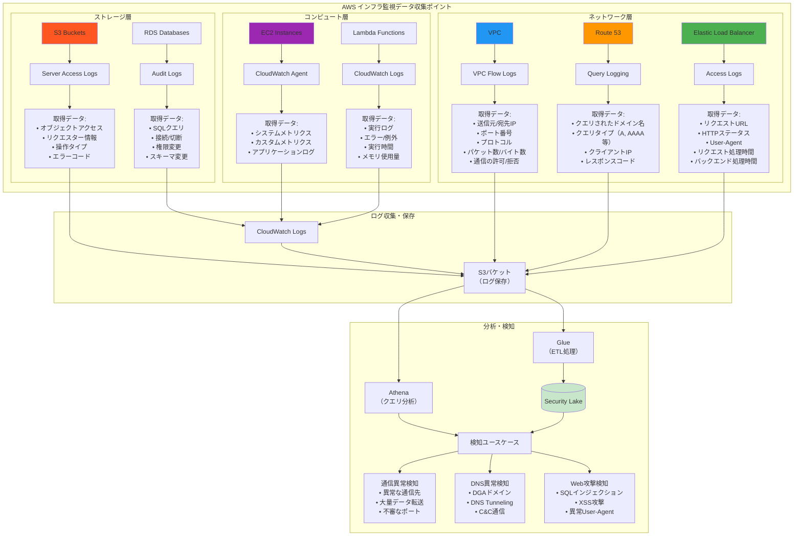
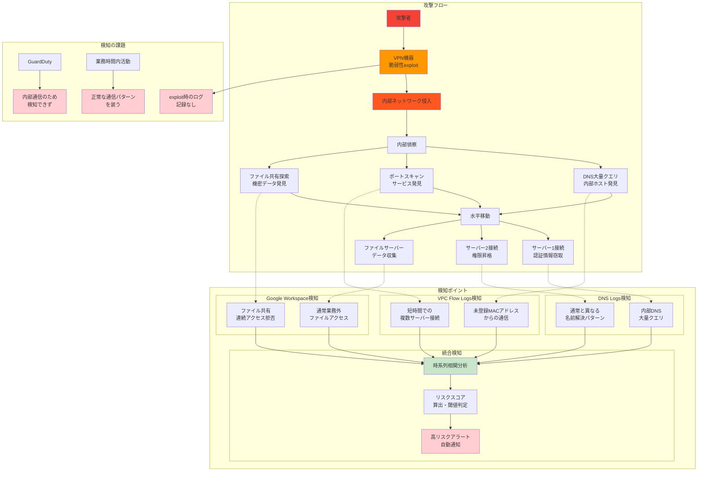

# クラウドセキュリティサービスとカスタム検知戦略

## 🛡️ クラウドプラットフォーム共通のセキュリティサービス概念

クラウドプラットフォームでは、様々なマネージドセキュリティサービスが提供されており、これらを組み合わせることで高度なセキュリティ対策が可能になります。しかし、汎用的なサービスだけでは組織固有の要件に対応できないため、カスタム検知戦略が重要となります。

また、セキュリティに限らず各種ログを収集するための仕組みも存在し、これらは監視だけでなく監査などの目的でも活用できます。

### マネージド脅威検知サービス（GuardDuty, Cloud Security Command Center等）

#### 機械学習ベースの脅威検知メカニズム

**検知アプローチ**
- **統計的分析**: 過去30-90日の通信パターン学習
- **脅威インテリジェンス**: 既知脅威データベースとの照合
- **行動ベースライン**: 組織固有の「正常」パターン構築

#### 検知可能な脅威タイプ

**ネットワーク異常**
- 暗号通貨マイニング通信
- ボットネット通信
- 異常なデータ転送量

**マルウェア検知**
- C&Cサーバー通信
- DGA（Domain Generation Algorithm）検知

**不正アクセス**
- ブルートフォース攻撃
- 地理的異常アクセス

#### **⚠️ 限界：汎用的な脅威のみ、組織固有ルール・ビジネスロジック依存の異常は検知不可**

**マネージドサービスが検知できない例**
- 業務時間外の特権アカウント使用（緊急対応 vs 不正使用の判別不可）
- 部門を超えたデータアクセス（正当な業務 vs 情報窃取の判別不可）
- 通常業務範囲内での異常パターン（営業データの大量ダウンロード等）

### セキュリティ統合管理サービス（Security Hub, Security Command Center等）

#### セキュリティ状況の一元管理

**機能概要**
- **多様なセキュリティツールの統合**: GuardDuty、Config、Inspector等の結果統合
- **統一ダッシュボード**: セキュリティ状況の可視化
- **AWS Security Finding Format (ASFF)**: 標準化フォーマットでの情報統合

#### コンプライアンスチェック自動化

**対応フレームワーク**
- **CIS Controls**: 基本的なセキュリティ設定チェック
- **PCI DSS**: 決済カード業界のコンプライアンス要件
- **SOC 2**: サービス組織統制レポート要件

#### **⚠️ 限界：定義済みルールベース、カスタムビジネスルール未対応**

**Security Hubが対応できない例**
- 組織固有のコンプライアンス要件（社内規程、業界固有ルール）
- ビジネス文脈を考慮した優先度付け（部門別重要度、業務影響度）
- 複合的な条件による高度な判定（時間+ユーザー+リソース+操作の組み合わせ）

### 監査ログ（CloudTrail, Cloud Logging等）

#### API監査ログの網羅的収集

**収集対象**
- **管理イベント**: IAM操作、リソース作成・削除
- **データイベント**: S3オブジェクトアクセス、Lambda実行
- **認証イベント**: ユーザーログイン、権限変更

#### **✅ 活用ポイント：カスタムルール実装の基盤として最適**

**カスタム検知での活用例**
- 複合条件での検知（時間+ユーザー+リソース+操作）
- 組織固有のパターン学習
- ビジネスコンテキストを考慮した判定

### 構成管理・アセット監視サービス（Config, Cloud Asset Inventory等）

#### 設定変更監視

**監視対象**
- **リソース設定の追跡**: セキュリティグループ、IAMポリシー、ストレージ設定
- **変更検知**: 設定変更のリアルタイム検知・記録
- **変更履歴**: いつ・誰が・何を変更したかの追跡

#### コンプライアンス監視

**自動評価項目**
- **セキュリティ設定基準**: CIS Benchmark等との継続的比較
- **組織ポリシー**: 社内セキュリティ基準との照合
- **法規制要件**: GDPR、SOX法等の要件チェック

#### アセットインベントリ

**全リソースの可視化・棚卸し**
- **リアルタイム一覧**: 全クラウドリソースの現在状況
- **タグベース管理**: 部門・プロジェクト別の分類
- **依存関係マッピング**: リソース間の関連性可視化

#### 活用例

**意図しない設定変更検知**
- 本番環境での危険な設定変更の即座検知
- 権限エスカレーション検知（管理者権限の追加等）
- コンプライアンス違反の自動検知

### インフラ監視データの活用

各種インフラコンポーネントから取得可能なログと、その活用方法を以下に示します。

#### 主要なAWSログの取得と活用

**ネットワーク・通信系ログ**
- **VPC Flow Logs**: 通信パターン異常（異常な通信先、プロトコル、ボリューム）の検知
- **Route 53 Query Logs**: DNS異常（DGA、DNS Tunneling、C&C通信）の検知
- **ELB Access Logs**: Web攻撃（SQLインジェクション、XSS、異常User-Agent）の検知

**ストレージ・データアクセス系ログ**
- **S3 Server Access Logs**: オブジェクトアクセス監視、不正ダウンロード検知
- **RDS Audit Logs**: SQLクエリ監視、権限変更、スキーマ変更の追跡
- **CloudTrail Data Events**: S3/Lambda等のデータプレーンイベント監視

これらのログはS3バケットやCloudWatch Logsに集約され、Athenaでのクエリ分析やSecurity Lakeでの統合分析に活用されます。

## プラットフォーム外から収集するべきデータ

クラウドネイティブなログだけでは、組織全体のセキュリティ状況を把握することはできません。プラットフォーム外のデータソースからの情報収集が重要です。

### アプリケーションログ

**ビジネスロジック固有のイベント**: ユーザー行動、機能利用パターン
- 🏫 **無敗塾例**: 学習進捗、試験受験、成績閲覧、教材ダウンロード

**認証・認可ログ**: アプリレベルでの権限チェック、失敗試行
- アプリケーション独自の権限システム
- 多要素認証の詳細ログ

**データアクセスログ**: 個人情報、機密データへのアクセス記録
- データベース層でのアクセス制御
- ファイルレベルでのアクセス追跡

### 外部連携システムのログ

**ID管理基盤（Okta等）**: SSO認証、プロビジョニング、権限変更
- 🏫 **無敗塾例**: 企業SSO連携、講師管理システム、成績管理システム

**決済システム**: 取引履歴、異常課金パターン
- 不正決済の検知
- 課金異常パターンの監視

**外部API連携**: サードパーティサービスとのデータ交換
- API使用量の監視
- レスポンス異常の検知

### SaaS・社内向けサービスログ

**Google Workspace**: ファイルアクセス、権限変更、共有設定
- 🏫 **無敗塾例**: 教材作成プロセス、開発ソースコード、学籍データ管理
- **重要**: アクセス成功だけでなく、`access_denied`ログも監視対象

**GitHub**: コード変更、アクセス制御、リポジトリ操作
- ソースコードの不正ダウンロード検知
- 権限変更の監視

**Slack/Teams**: 機密情報の共有、ファイル送信
- 機密データの誤送信検知
- 外部ドメインとの通信監視

### エンドポイント・デバイスログ

**MDM（Mobile Device Management）**: デバイス管理、アプリインストール
- 🏫 **無敗塾例**: 講師・職員の業務端末、試験監督用デバイス

**EDR（Endpoint Detection and Response）**: ファイル操作、プロセス実行
- 不正なファイル操作の検知
- マルウェア実行の早期発見

### オフィスネットワーク・物理セキュリティログ

**ファイアウォール・プロキシログ**: 外部通信、Webアクセス制御
- 危険サイトへのアクセス試行
- データ流出の可能性がある大量通信

**無線LAN（Wi-Fi）ログ**: デバイス接続、認証失敗、不正AP検知
- 未許可デバイスの接続試行
- 不正アクセスポイントの検知

**VPN接続ログ**: リモートアクセス、接続元地域、異常接続パターン
- 地理的に異常な接続の検知
- 時間外アクセスの監視

**入退室管理システム**: 物理アクセス、時間外入室、共連れ検知
- 🏫 **無敗塾例**: 講師控室アクセス、サーバールーム入退室、学生の施設利用

## AWSにおける取得可能なログと取得の構成



## 🎯 カスタム検知が必要な実例とビジネスケース

### 🏫 無敗塾での実例を中心とした説明

マネージドセキュリティサービスでは検知困難だが、カスタム検知で対応可能な実例を無敗塾のケーススタディで解説します。

### 実例1：フェーズ2セキュリティインシデントからの学び

**ケース：無敗ラーニング拡大期、夜間に管理者が大量の学習データをダウンロード**

```
GuardDuty判定: ✅ 正常
→ 正当な認証情報使用（正規の管理者アカウント）

カスタム検知: ⚠️ アラート  
→ 業務時間外 + 特権アカウント + データ量閾値 = アラート
```

**検知ロジックの詳細**
- **時間条件**: 業務時間外（21:00-8:00）のアクセス
- **権限条件**: データベース管理者権限でのダイレクトアクセス
- **データ量**: 通常の10倍を超える学習データダウンロード
- **ユーザー属性**: 通常は夜間作業をしない管理者

**無敗塾での教訓**: 正当な権限を持つ内部者による不正は、マネージドサービスでは検知が困難

### 実例2：フェーズ3（無敗大学）での学籍データ保護

**ケース：講師アカウントが試験期間外に成績データへ大量アクセス**

```
Security Hub判定: ✅ 権限は正しく設定
→ 講師として適切な権限、コンプライアンスチェック通過

カスタム検知: ⚠️ FERPA違反リスク検知
→ 役職 + 時期 + アクセスパターン = アラート
```

**検知ロジックの詳細**
- **役職条件**: 講師アカウントによる成績データアクセス
- **時期条件**: 試験期間外（成績入力期間以外）
- **パターン条件**: 複数クラスの成績データを短時間で大量アクセス
- **法規制考慮**: FERPA（米国教育プライバシー法）の要件

**Google Workspace監査ログでの検知**:
```sql
SELECT user_email, file_name, COUNT(*) as access_count
FROM workspace_audit_logs 
WHERE event_name = 'access' 
  AND file_path LIKE '%/grades/%'
  AND user_role = 'teacher'
  AND time NOT BETWEEN exam_period_start AND exam_period_end
GROUP BY user_email, file_name
HAVING COUNT(*) > 50
```

### 実例3：フェーズ4（無敗リスキリング）でのVPN機器経由攻撃

**ケース：VPN機器の脆弱性を悪用して内部ネットワークに侵入、攻撃者が業務時間内に正常な通信パターンで水平移動を実行**

```
GuardDuty判定: ✅ 内部通信のため検知せず
VPN機器: ✅ exploit時のログ記録なし

カスタム検知: ⚠️ 内部偵察・データ収集検知
→ 未登録MACアドレス + サーバー群への順次接続 + ファイル共有大量アクセス = アラート
```

**複合的検知ロジック**
- **ネットワーク異常**: 未登録MACアドレスからの正常ポート通信
- **アクセスパターン**: 業務時間内だが通常アクセスしないサーバー群への順次接続
- **データアクセス**: ファイル共有への異常な大量アクセス
- **時系列相関**: 短時間での複数システム探索行動

**統合データソースでの検知**:
- **VPC Flow Logs**: 内部ネットワークでの異常通信パターン
- **DNS Logs**: 内部DNSでの大量名前解決クエリ
- **Google Workspace**: ファイルサーバーへの連続アクセス拒否ログ


*VPN経由侵入 → 内部偵察 → データ収集の一連の流れと、各段階での検知ポイントを図示*

## 🏢 無敗塾の成長段階別カスタム検知戦略

### 創業期（フェーズ1）：基本的な異常検知（時間外アクセス、地理的異常）

**限られたリソースでの重点実装**
- **管理者権限の異常使用**: 時間外でのroot権限利用
- **地理的異常アクセス**: 海外からのサービスアクセス
- **基本的なデータ保護**: S3バケットの公開設定変更検知

**実装の特徴**
- シンプルなルールベースの検知
- 誤検知を避けた確実な脅威のみに絞った対応
- CloudWatch Alarmsを活用した低コスト実装

### 事業拡大期（フェーズ2）：企業ユーザー向けSSO統合での部門別監視

**企業顧客対応での高度化**
- **部門別アクセス制御**: 営業部門による技術資料アクセスの監視
- **SSO連携監視**: 企業ユーザーの異常ログインパターン検知
- **データ量監視**: 通常の10倍を超える学習データダウンロード

**複合条件の導入**
- **時間 + 権限 + データ量**: 複数条件を組み合わせた高精度検知
- **ベースライン学習**: 過去30日のユーザー行動パターン学習

### 市場拡大期（フェーズ3）：法規制対応（GDPR、FERPA）での高度化

**コンプライアンス要求への対応**
- **FERPA対応**: 学籍データアクセスの厳格な監視
- **GDPR対応**: EU居住者データの適切な取り扱い監視
- **法定保持期間**: データ削除の適切性監視

**高度な検知ロジック**
- **法規制ベースルール**: 教育業界特有の規制要件を組み込み
- **国際展開対応**: 複数国の法規制を同時満足する設計

### 専門教育期（フェーズ4）：AI/ML活用、サプライチェーン監視

**高度なセキュリティ脅威への対応**
- **AIモデル保護**: 学習データへの不正アクセス防止
- **サプライチェーン監視**: 外部講師・パートナー企業の異常行動検知
- **高度な攻撃検知**: 複数システムを跨ぐ巧妙な攻撃パターン

**機械学習の活用**
- **異常検知AI**: ユーザー行動の自動パターン学習
- **相関分析**: 複数データソースからの統合分析

### グローバル展開（フェーズ5）：マルチリージョン統合監視

**国際的なセキュリティ運用**
- **24時間監視体制**: 時差を活用したグローバルSOC運用
- **リージョン横断分析**: 複数国でのデータ統合分析
- **文化的コンテキスト**: 各国の業務慣習を考慮した検知ルール

```mermaid
graph TB
    subgraph "無敗塾 成長段階別セキュリティ成熟度"
        subgraph "フェーズ1: 創業期"
            P1_SYS[監視システム]
            P1_SYS --> P1_MON[CloudWatch基本監視]
            P1_SYS --> P1_LOG[CloudTrail基本ログ]
            
            P1_DET[検知能力]
            P1_DET --> P1_RULE[シンプルルール<br/>• 時間外アクセス<br/>• 地理的異常]
            
            P1_TEAM[チーム体制]
            P1_TEAM --> P1_DEV[開発者兼務<br/>専任者なし]
        end
        
        subgraph "フェーズ2: 事業拡大期"
            P2_SYS[監視システム]
            P2_SYS --> P2_MON[CloudWatch詳細監視]
            P2_SYS --> P2_VPC[VPC Flow Logs]
            P2_SYS --> P2_XR[X-Ray分散トレース]
            
            P2_DET[検知能力]
            P2_DET --> P2_RULE[複合条件検知<br/>• 時間×権限×データ量<br/>• ベースライン学習]
            
            P2_TEAM[チーム体制]
            P2_TEAM --> P2_SEC[セキュリティ担当2-3名<br/>SREチーム発足]
        end
        
        subgraph "フェーズ3: 市場拡大期"
            P3_SYS[監視システム]
            P3_SYS --> P3_LAKE[Security Lake統合]
            P3_SYS --> P3_GWS[Google Workspace監視]
            P3_SYS --> P3_OKTA[Okta SSO監視]
            
            P3_DET[検知能力]
            P3_DET --> P3_RULE[法規制対応検知<br/>• GDPR/FERPA準拠<br/>• 高精度相関分析]
            
            P3_TEAM[チーム体制]
            P3_TEAM --> P3_SEC[セキュリティチーム発足<br/>ガバナンス強化]
        end
        
        subgraph "フェーズ4: 専門教育期"
            P4_SYS[監視システム]
            P4_SYS --> P4_AI[AI/ML統合監視]
            P4_SYS --> P4_SC[サプライチェーン監視]
            P4_SYS --> P4_ADV[高度な脅威検知]
            
            P4_DET[検知能力]
            P4_DET --> P4_RULE[機械学習検知<br/>• 異常パターン自動発見<br/>• 複数システム相関]
            
            P4_TEAM[チーム体制]
            P4_TEAM --> P4_SEC[専門チーム細分化<br/>AI専門者配置]
        end
        
        subgraph "フェーズ5: グローバル展開"
            P5_SYS[監視システム]
            P5_SYS --> P5_GLOBAL[マルチリージョン統合]
            P5_SYS --> P5_SOC[24時間SOC運用]
            P5_SYS --> P5_TI[脅威インテリジェンス]
            
            P5_DET[検知能力]
            P5_DET --> P5_RULE[国際的高度検知<br/>• 文化的コンテキスト<br/>• リアルタイム対応]
            
            P5_TEAM[チーム体制]
            P5_TEAM --> P5_SEC[CISO配置<br/>国際SOCチーム]
        end
    end
    
    subgraph "成熟度指標"
        COMPLEXITY[監視複雑さ]
        COMPLEXITY --> C1[シンプル]
        COMPLEXITY --> C2[中程度]
        COMPLEXITY --> C3[複雑]
        COMPLEXITY --> C4[非常に複雑]
        COMPLEXITY --> C5[最高度]
        
        ACCURACY[検知精度]
        ACCURACY --> A1[基本]
        ACCURACY --> A2[改善]
        ACCURACY --> A3[高精度]
        ACCURACY --> A4[AI活用]
        ACCURACY --> A5[国際水準]
        
        COVERAGE[カバレッジ]
        COVERAGE --> COV1[AWS基本]
        COVERAGE --> COV2[クラウド＋SaaS]
        COVERAGE --> COV3[統合監視]
        COVERAGE --> COV4[AI・SC監視]
        COVERAGE --> COV5[グローバル統合]
    end
    
    P1_RULE -.-> C1
    P2_RULE -.-> C2
    P3_RULE -.-> C3
    P4_RULE -.-> C4
    P5_RULE -.-> C5
    
    P1_RULE -.-> A1
    P2_RULE -.-> A2
    P3_RULE -.-> A3
    P4_RULE -.-> A4
    P5_RULE -.-> A5
    
    P1_SYS -.-> COV1
    P2_SYS -.-> COV2
    P3_SYS -.-> COV3
    P4_SYS -.-> COV4
    P5_SYS -.-> COV5
    
    style P1_RULE fill:#e3f2fd
    style P2_RULE fill:#f3e5f5
    style P3_RULE fill:#fff3e0
    style P4_RULE fill:#e8f5e8
    style P5_RULE fill:#fce4ec
    
    style C5 fill:#c8e6c9
    style A5 fill:#c8e6c9
    style COV5 fill:#c8e6c9
```


*フェーズ1-5における監視の複雑さと検知精度の向上を時系列で図示*

## 💡 実装のベストプラクティス

### 段階的実装アプローチ

**Step 1: 高リスク・高確度から開始**
- 無敗塾フェーズ2のインシデントのような「確実に問題となる」パターンから実装
- 誤検知の少ないルールで運用経験を積む

**Step 2: ビジネスコンテキストの組み込み**
- 組織情報（部門・役職・プロジェクト）の活用
- 業務カレンダー（試験期間、メンテナンス時間）の考慮
- データ分類（機密度・重要度）の明確化

**Step 3: 継続的改善プロセス**
- 月次でのルール精度評価
- 現場からの誤検知報告収集
- ベースライン・閾値の継続調整

## 🚀 次のセクションへ

**これまでのポイント**
- **マネージドサービスの限界**: 汎用的脅威のみ、組織固有ルール未対応
- **プラットフォーム外データの重要性**: Google Workspace、GitHub、物理セキュリティ等
- **カスタム検知の有効性**: ビジネスコンテキスト + 複合条件による高精度分析

**次は基盤統合の話**
- なぜ監視基盤を統一する必要があるのか？
- ログ同士の突合（相関分析）の重要性
- スキーマ共通化のメリット・デメリット 