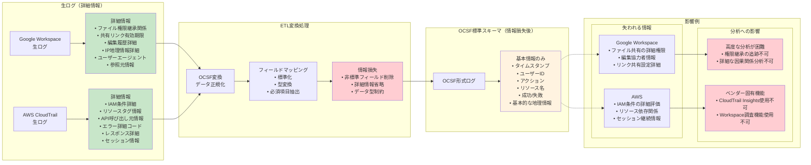

# セキュリティ監視基盤の統合と段階的構築

## 🔗 基盤統一の必要性と効果

前のセクションで学んだように、現代のセキュリティ監視では多様なデータソースからの情報収集が必要です。しかし、これらのデータが分散していると、真の脅威を見逃す可能性が高くなります。

### ログ同士の突合（相関分析）の重要性

**単一ソースでは見えない攻撃パターン**

攻撃者は複数のシステムを跨いで巧妙に行動するため、単一のログソースだけでは全体像を把握できません。

🏫 **無敗塾での実例**: Google Workspace ログイン失敗 + AWS 権限昇格試行 = 総合的脅威判定

```
時系列での相関例:
10:15 - Google Workspace: user@muhaijuku.com ログイン失敗 (パスワード間違い)
10:16 - Google Workspace: 同じユーザーでログイン失敗 (5回目)  
10:20 - AWS CloudTrail: 同じユーザーでIAM権限変更試行
10:22 - VPC Flow Logs: 内部サーバーへの異常ポートスキャン

個別の判定:
→ Google Workspace: 一般的なログイン失敗
→ AWS CloudTrail: 権限変更は正常な範囲内
→ VPC Flow Logs: 内部通信のため低リスク

統合分析の判定:
→ 複数システムでの連続した異常行動パターン = 高リスク脅威
```

**時系列相関の威力**

異なるシステムでの時間的に関連する異常イベントを組み合わせることで、高精度な脅威検知が可能になります。


*複数システムの時系列イベントを並べて、攻撃の全体像を可視化した図*

### 管理の集約による運用効率化

**一元的なアラート管理**

分散したアラートシステムでは、重要な脅威が埋もれてしまう可能性があります。

**無敗塾フェーズ2での課題**:
- AWS CloudWatch Alarms: 15件/日
- Google Workspace セキュリティアラート: 8件/日  
- GitHub セキュリティアドバイザリ: 3件/日
- ファイアウォール異常検知: 12件/日

**問題**: 合計38件のアラートが異なるシステムから通知され、優先度判定が困難

**統合後の改善**:
- 統一されたダッシュボードで全アラートを可視化
- 重要度に基づく自動優先度付け
- 関連アラートの自動グループ化

**統一されたダッシュボード**

複数システムの状況を単一画面で把握することで、運用チームの負荷を大幅に削減できます。


*AWS、Google Workspace、GitHub、ネットワーク機器の状況を一画面に統合したダッシュボード*

**スキル・知識の集約**

個別のツールそれぞれの習得コストを削減し、チーム全体のセキュリティ知識を向上させます。

- **従来**: 各ツール専門者が必要（AWS専門者、Google Workspace専門者、ネットワーク専門者）
- **統合後**: 統一インターフェースにより、少数の専門者で幅広いカバレッジが可能

## ⚖️ スキーマ共通化のメリット・デメリット

### 👍 メリット（Pros）

**クエリの汎用性**

共通スキーマ（OCSF等）を採用することで、同一のSQLクエリで複数のデータソースを検索できます。

```sql
-- OCSF共通フォーマットでの例
SELECT user_name, activity_name, count(*) 
FROM security_events 
WHERE time > NOW() - INTERVAL '1 HOUR'
  AND risk_level = 'High'
GROUP BY user_name, activity_name
HAVING count(*) > 5

-- このクエリで以下のデータソースを横断検索:
-- - AWS CloudTrail (activity_name = 'AssumeRole')  
-- - Google Workspace (activity_name = 'Login')
-- - GitHub (activity_name = 'PushCode')
```

**検知ルールの再利用**

共通フォーマットにより、一度作成した検知ルールを複数の環境で再利用できます。

**分析ツールの統一**

Business Intelligence（BI）ツールや機械学習基盤を一つのスキーマに最適化することで、開発・運用コストを削減できます。

### 👎 デメリット（Cons）

**変換処理のオーバーヘッド**

各データソースから共通フォーマットへの変換（ETL処理）により、遅延とコストが発生します。

**無敗塾での実測例**:
- **生ログ投入**: Google Workspace → S3 (平均5秒)
- **OCSF変換処理**: S3 → Security Lake (平均45秒)
- **合計遅延**: 50秒（リアルタイム検知に影響）

**元データの情報損失**

標準化により、ソース固有の重要な情報が失われる可能性があります。

**例**: Google Workspace の豊富なファイル共有権限情報
- **生ログ**: 詳細な権限設定、継承関係、有効期限
- **OCSF変換後**: 基本的なアクセス可否のみ

**ソース固有機能の制約**

各システム特有の豊富な分析機能を活用できなくなる場合があります。

- **AWS CloudTrail Insights**: AWS特有の異常検知機能
- **Google Workspace Security Investigation**: Google特有の調査機能


*元データの詳細情報が共通スキーマ変換で失われる様子を視覚化*

## 🏫 無敗塾における段階的統合戦略

### フェーズ1（創業期）: システムごとのログ保全

**基本的なログ収集と保存**
- 各システムの標準ログ機能を有効化
- 長期保存のためのS3への自動アーカイブ
- 手動での定期確認（週次）

**実装内容**:
- AWS CloudTrail の全API監査ログ
- Google Workspace の基本監査ログ
- アプリケーションログのCloudWatch Logs保存

### フェーズ2（事業拡大期）: 可能な範囲でのログの収集と保全、マニュアルによるログの検査

**重要システムの監視強化**
- セキュリティインシデント対応での教訓を活用
- 手動での相関分析プロセス確立
- アラート通知の基本的な統合

**実装の特徴**:
- インシデント発生時の手動調査フロー確立
- 重要アラートの Slack 通知統合
- 月次でのログ分析レポート作成

### フェーズ3（市場拡大期）: 包括的統合によるログ収集・保全と検知システムの導入

**Security Lake基盤の構築**
- OCSF フォーマットでの統合データレイク
- 自動化された検知ルールの実装
- リアルタイム相関分析の開始

**対応システム**:
- AWS（CloudTrail、VPC Flow Logs、GuardDuty）
- Google Workspace（監査ログ、セキュリティログ）
- GitHub（監査ログ、セキュリティアラート）
- Okta（認証ログ、プロビジョニングログ）

### フェーズ4-5（専門・グローバル展開）: 専門チームの編成や、検知システムの改善サイクルの実施

**高度なセキュリティ運用**
- 専門的なセキュリティチームによる24時間監視
- 機械学習を活用した高度な異常検知
- 継続的な検知精度向上プロセス

**グローバル統合**:
- マルチリージョンでのログ統合
- タイムゾーンを考慮した相関分析
- 各国の法規制要件を満たすデータ管理

```mermaid
timeline
    title 無敗塾の段階的統合ロードマップ
    
    section フェーズ1: 創業期
        システムごとのログ保全
        : AWS CloudTrail基本ログ
        : Google Workspace基本監査
        : 手動での週次確認
        : S3への基本アーカイブ
        
    section フェーズ2: 事業拡大期  
        重要システム統合
        : VPC Flow Logs追加
        : X-Ray分散トレース
        : Slack通知統合
        : 手動相関分析プロセス
        : インシデント対応フロー確立
        
    section フェーズ3: 市場拡大期
        包括的統合基盤
        : Security Lake構築
        : OCSF形式での統合
        : Okta SSO監視追加
        : GitHub監査ログ統合
        : 自動検知ルール実装
        : リアルタイム相関分析
        
    section フェーズ4: 専門教育期
        AI/ML活用高度化
        : 機械学習検知導入
        : サプライチェーン監視
        : 行動ベースライン学習
        : 専門チーム細分化
        : 高度な脅威対応
        
    section フェーズ5: グローバル展開
        国際統合監視
        : マルチリージョン統合
        : 24時間SOC運用
        : 脅威インテリジェンス
        : 文化的コンテキスト対応
        : 国際水準セキュリティ認証
```
*フェーズ1-5での監視システムの進化を時系列で図示、各段階での対象システムとカバレッジを表示*

## 🎯 統合戦略の判断基準

### コスト vs 効果の評価

**Phase 1評価ポイント**: 
- 既存ツールの活用度
- 手動作業の許容範囲
- インシデント対応時間の要件

**Phase 2-3移行の判断基準**:
- 1日あたりのアラート件数（20件超で統合検討）
- インシデント調査時間（4時間超で統合メリット大）
- 法規制要件の追加（GDPR、FERPA等）

### 段階的実装のベストプラクティス

**重要システムから順次統合**
1. **Tier 1**: 本番環境、決済システム、顧客データ
2. **Tier 2**: 開発環境、社内システム
3. **Tier 3**: 検証環境、ログ保存のみシステム

**誤検知を最小化する導入**
- パイロット運用での精度検証
- 既存アラートとの並行運用期間設定
- 段階的な閾値調整

## 🚀 次のセクションへ

**これまでのまとめ**
- **基盤統一の価値**: 相関分析による高精度脅威検知、運用効率化
- **スキーマ共通化**: メリット（汎用性、再利用性）vs デメリット（情報損失、変換コスト）
- **段階的統合**: 無敗塾の成長に合わせた現実的な実装戦略

**次は実習**
- AWS Security Lake を使った実際の統合基盤構築
- Google Workspace 監査ログを使ったカスタム検知実装
- 無敗塾シナリオでの実践的な脅威検知ルール作成