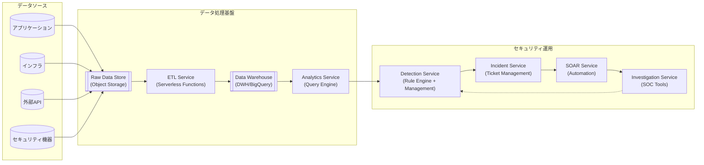

# クラウド監視環境のアーキテクチャ

## 🏗️ 一般的なログ分析アーキテクチャ

### 基本的なデータフロー

**ログ収集・分析の標準パターン**



**図の見方**
- **○ データソース**: ログの発生源
- **⬜ Service**: 処理・機能を提供するサービス
- **⬛ Storage**: データを保存するストレージ
- **→ データフロー**: データの主要な流れ
- **⇢ フィードバック**: 改善・強化のループ

**クラウド横断での共通概念**
- **オブジェクトストレージ**: AWS S3 / Azure Blob / GCP Cloud Storage
- **サーバーレス処理**: AWS Lambda / Azure Functions / GCP Cloud Functions  
- **データウェアハウス**: AWS Redshift / Azure Synapse / GCP BigQuery

### アーキテクチャの構成要素

#### 1. データ収集層

**ログソースの分類**
- **システムログ**: OS、ミドルウェア、アプリケーションログ
- **セキュリティログ**: 認証、API呼び出し、ネットワーク通信
- **運用ログ**: 設定変更、デプロイ、パフォーマンス指標

**収集方式**
- **プッシュ型**: ログ転送エージェント（FluentD、Logstash等）
- **プル型**: API経由での定期取得
- **ストリーム型**: リアルタイムデータストリーム

#### 2. データ保存層（オブジェクトストレージ）

**Raw Data Storage**
```
s3://logs-raw-bucket/
├── application-logs/date=2024-08-12/
├── security-logs/date=2024-08-12/
└── infrastructure-logs/date=2024-08-12/
```

**保存形式の選択肢**
- **JSON**: 可読性高、クエリコスト高
- **Parquet**: 圧縮効率・クエリ速度最適化
- **Avro**: スキーマ進化に対応

#### 3. ETL処理層（サーバーレス関数）

**変換処理の典型例**
```python
# 擬似コード例
def lambda_handler(event, context):
    # Raw JSONログを読み取り
    raw_log = read_from_s3(event['Records'])
    
    # 正規化・構造化
    normalized = normalize_log_format(raw_log)
    
    # フィルタリング・集約
    filtered = apply_security_filters(normalized)
    
    # 構造化データとして保存
    write_to_s3_structured(filtered)
```

**処理のポイント**
- **スキーマ正規化**: 異なるソースからの統一フォーマット作成
- **データ品質向上**: 欠損値補完、異常値検知
- **パフォーマンス最適化**: パーティション設計、圧縮

#### 4. データウェアハウス層

**分析・検索エンジンの役割**
- **高速SQL処理**: 大量データに対する集計・分析クエリ
- **リアルタイム検索**: 秒単位での異常検知
- **長期保存**: 法規制対応、トレンド分析

**主要サービス比較**

| プラットフォーム | サービス名 | 特徴 | 適用場面 |
|---------------|-----------|------|----------|
| **AWS** | Redshift | カラムナ DB、大規模バッチ処理 | 定期レポート、長期分析 |
| | Athena | サーバーレス、S3直接クエリ | アドホック分析、コスト重視 |
| **Azure** | Synapse Analytics | 統合分析プラットフォーム | エンタープライズ分析基盤 |
| **GCP** | BigQuery | フルマネージド、ML統合 | リアルタイム分析、機械学習 |

## 🎯 実装時の考慮事項

### パフォーマンス最適化

**パーティション設計**
- **時間ベース**: `date=2024-08-12/hour=14/`
- **地域ベース**: `region=us-east-1/`
- **ログタイプ別**: `log_type=security/`

**クエリ最適化**
```sql
-- 効率的なクエリ例
SELECT source_ip, COUNT(*) as connection_count
FROM network_logs 
WHERE date >= '2024-08-12' 
  AND log_type = 'vpc_flow'
GROUP BY source_ip
HAVING connection_count > 1000
```

### セキュリティ・ガバナンス

**アクセス制御**
- **IAMロール**: 最小権限の原則
- **データ分類**: 機密度に応じたアクセス制限
- **監査ログ**: データアクセス履歴の記録

**コンプライアンス対応**
- **データ保持期間**: 法規制要件への対応
- **暗号化**: 転送時・保存時の暗号化
- **地域制限**: データ保存場所の制御

---

**🎯 次のステップ**  
実際にGo言語でLambda関数を実装し、このアーキテクチャ上で検知ルールを作成します！ 