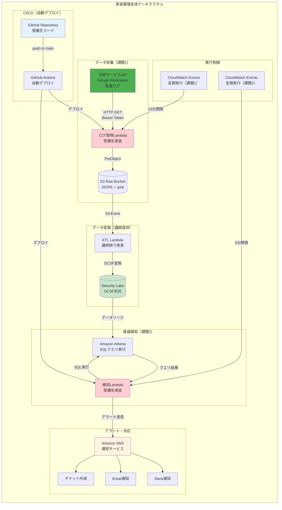

# 実習概要：AWS Security Lake実装

## 🎯 実習の目的

### セキュリティ監視のワークフローの一部を構築してみる

これまでの理論編で学んだ内容を実際に手を動かして体験します：
- 外部サービスからのログ収集
- データレイクでの統合ログ管理
- カスタム検知ルールの実装と運用

### セキュリティ監視の検知ルールを考え、実装してみる

理論だけでなく、実際のログデータを使って脅威シナリオを検討し、検知SQLを作成します。

### 🏫 無敗塾のシナリオを使った実践的学習

理論編で説明した無敗塾の具体的なセキュリティ課題をベースに、現実的なユースケースで学習します。

## 🏗️ 実習環境のアーキテクチャ

### 全体構成

今回構築する監視システムの全体像を理解しましょう。


*外部API → Lambda → S3 → Security Lake → Athena → 検知Lambda → SNS の流れを図示*

### 処理の流れと実習でやるべきポイント

**データ収集から検知までの一連の流れ**

1. **外部サービスAPI**（講師側で用意）からログを取得してS3に配置するLambdaを実装（課題1）
2. **S3に配置されたオブジェクトデータ**は講師側で用意したETL LambdaによってSecurity Lakeに配置される
3. **データレイクに対して一定間隔で実行されるLambda**からSQLクエリを実行し、不審な行動を見つける（課題2）
4. **通知された先でアラートを確認**しチケットを作成してみる

## 🏛️ AWS Security Lakeについて

### 今回の演習で利用するデータレイク

AWS Security Lakeは、セキュリティデータを中央集権的に管理するAWSのマネージドサービスです。

### AWSサービスの複合体サービス

Security Lakeは以下のAWSサービスを組み合わせた統合サービスです：
- **Amazon S3**: データストレージ
- **AWS Glue**: データカタログとETL
- **Amazon Athena**: SQLクエリエンジン  
- **AWS Lake Formation**: データレイク管理

```mermaid
graph TB
    subgraph "AWS Security Lake 内部構成"
        subgraph "データストレージ層"
            S3[Amazon S3<br/>パーティション化ストレージ]
            S3 --> PART1[year=2024/month=08/day=12/<br/>hour=10/data.parquet]
            S3 --> PART2[year=2024/month=08/day=12/<br/>hour=11/data.parquet]
        end
        
        subgraph "データカタログ・ETL"
            GLUE[AWS Glue<br/>データカタログ]
            CATALOG[Data Catalog<br/>• テーブル定義<br/>• スキーマ管理<br/>• パーティション情報]
            ETL_GLUE[Glue ETL Jobs<br/>データ変換処理]
            
            GLUE --> CATALOG
            ETL_GLUE --> CATALOG
        end
        
        subgraph "クエリエンジン"
            ATHENA[Amazon Athena<br/>SQLクエリ実行]
            QUERY[SQL実行例<br/>SELECT user, event<br/>FROM security_events<br/>WHERE time > '2024-08-12']
            
            ATHENA --> QUERY
        end
        
        subgraph "データガバナンス"
            LF[AWS Lake Formation<br/>データレイク管理]
            PERM[権限管理<br/>• カラムレベル制御<br/>• 行レベル制御<br/>• タグベース権限]
            
            LF --> PERM
        end
        
        subgraph "OCSF形式データ"
            OCSF[Open Cybersecurity<br/>Schema Framework]
            SCHEMA[標準フィールド<br/>• metadata.event_time<br/>• actor.user.name<br/>• api.operation<br/>• resources[].name]
            
            OCSF --> SCHEMA
        end
    end
    
    subgraph "データフロー"
        RAW[生ログ<br/>（JSONL）] --> ETL_GLUE
        ETL_GLUE --> OCSF
        OCSF --> S3
        S3 --> CATALOG
        CATALOG --> ATHENA
        LF --> ATHENA
    end
    
    subgraph "パフォーマンス最適化"
        COMPRESS[Parquet圧縮<br/>高効率ストレージ]
        PARTITION[時間ベース<br/>パーティション]
        INDEX[インデックス<br/>高速クエリ]
        
        S3 -.-> COMPRESS
        S3 -.-> PARTITION
        ATHENA -.-> INDEX
    end
    
    style S3 fill:#ff9800
    style ATHENA fill:#4caf50
    style GLUE fill:#2196f3
    style LF fill:#9c27b0
    style OCSF fill:#c8e6c9
```
*S3、Glue、Athena、Lake Formationの関係性を図示*

### Open Cybersecurity Schema Framework (OCSF)

**標準化されたセキュリティデータフォーマット**

OCSFは、異なるセキュリティツールからのデータを統一フォーマットで管理するための標準仕様です。

**主要なメリット**:
- 複数ベンダーのツール間でのデータ互換性
- 統一されたクエリでの横断検索
- セキュリティ分析ツールとの高い親和性

### parquetベースのデータレイク

**高効率なカラムナ型データフォーマット**

Parquetフォーマットにより、大量のログデータに対する高速なクエリ実行が可能です。

**特徴**:
- 圧縮率が高く、ストレージコスト削減
- カラムナ型のため、特定フィールドのみの検索が高速
- スキーマ進化に対応

### S3上のデータ構造

Security Lake内のデータは、以下のような階層構造でS3に保存されます：

```
s3://security-lake-bucket/
├── region=ap-northeast-1/
│   ├── account_id=123456789012/
│   │   ├── event_time=2024-08-12-10/
│   │   │   ├── workspace_audit.parquet
│   │   │   ├── github_audit.parquet
│   │   │   └── network_flow.parquet
│   │   └── event_time=2024-08-12-11/
│   └── account_id=123456789013/
└── region=us-west-2/
```

**パーティション設計の重要性**:
- 時間ベースパーティション（hour単位）により、クエリ高速化
- アカウント・リージョン別分離により、権限管理とコスト最適化

## 📋 課題について

### 課題1: ログ取得Lambdaの実装

**目的**: 外部サービスから定期的にログを取得し、適切な形式でS3に保存する

#### HTTPエンドポイントからのデータ取得

**提供されるAPI**:
- エンドポイント: `https://api.workshop.example.com/logs`
- 認証: Bearer token（環境変数で提供）
- レスポンス: JSONL形式のログデータ

**APIの特徴**:
- 時間範囲指定でのログ取得が可能
- 1回のリクエストで最大1時間分のログを取得
- レート制限: 1分間に10回まで

#### 時刻調整とログの重複をどこまで許容するかなどがポイント

**課題のポイント**:
- **Lambdaの実行間隔は正確ではない**（CloudWatch Eventsの特性）
- **ログの取得漏れを最小化**しつつ、**重複を許容範囲内に抑制**
- **障害時の再処理**を考慮した設計

**実装方針の例**:
```go
// 前回実行時刻の管理方法
lastExecutionTime := getLastExecutionTime() // DynamoDBから取得
currentTime := time.Now()

// 若干のオーバーラップを許容して取得漏れを防ぐ  
startTime := lastExecutionTime.Add(-5 * time.Minute)
endTime := currentTime

logs := fetchLogs(startTime, endTime)
deduplicatedLogs := removeDuplicates(logs) // ログIDベースの重複除去
```

#### 取得したログはJSONL形式を圧縮して指定されたS3バケットにPutObject

**実装要件**:
- **JSONL（JSON Lines）形式**: 1行に1つのJSONオブジェクト
- **gzip圧縮**: ストレージコスト削減とネットワーク効率化
- **適切なキー設計**: 後続のETL処理での効率的な読み込み

**S3キー設計例**:
```
workspace-logs/year=2024/month=08/day=12/hour=10/logs-20240812T100000Z.jsonl.gz
```

### 課題2: 検知用SQLの作成と実行

**目的**: Security Lakeに蓄積されたデータから、無敗塾シナリオベースの脅威を検知する

#### まずWebコンソールからSQLを実行してどのようなログが投入されているか確認

**Athenaコンソールでの作業**:
- Security Lakeのテーブル構造確認
- サンプルデータの中身確認
- フィールド定義とデータ型の理解

**確認すべきポイント**:
```sql
-- テーブル構造の確認
DESCRIBE security_lake_table;

-- データ量の確認  
SELECT COUNT(*) FROM security_lake_table 
WHERE partition_date = '2024-08-12';

-- サンプルデータの確認
SELECT * FROM security_lake_table 
LIMIT 10;
```

#### ログデータの取得を確認したらそこから見つけるべき脅威のシナリオを考える

**無敗塾ベースの脅威シナリオ選択**

以下のいずれかのシナリオから選択（または複数実装）:

1. **フェーズ3シナリオ**: 講師の試験期間外成績データアクセス
   - Google Workspace監査ログでの`access_denied`連続発生
   - 成績フォルダへの業務時間外アクセス

2. **フェーズ4シナリオ**: 外部講師のAI学習データ権限外アクセス  
   - 外部ドメインユーザーによる機密フォルダアクセス試行
   - 契約範囲外データへの連続アクセス

3. **フェーズ5シナリオ**: 海外リージョンからの管理者権限使用
   - 地理的に異常な場所からの管理者操作
   - 通常とは異なる時間帯での特権操作

#### そのSQLをLambdaに組み込んでデプロイし実際に実行させる

**検知SQLの例**（フェーズ3シナリオの場合）:
```sql
SELECT 
    user_email,
    file_path,
    COUNT(*) as denied_attempts,
    MIN(event_time) as first_attempt,
    MAX(event_time) as last_attempt
FROM security_lake_table
WHERE 
    event_time > CURRENT_TIMESTAMP - INTERVAL '1' HOUR
    AND event_name = 'access_denied'
    AND file_path LIKE '%/grades/%'
    AND user_domain != 'muhaijuku.com'  -- 外部ユーザー
GROUP BY user_email, file_path
HAVING COUNT(*) > 5  -- 1時間で5回以上の拒否
```

**Lambda実装での考慮点**:
- SQLパラメータの動的生成（時間範囲等）
- 結果の構造化とSNS通知形式
- エラーハンドリングとリトライ機構

## 🛠️ 前提条件

### スケルトンがすでにGitHubに用意されている

**課題1**: HTTP取得 & S3 PutObjectまでの基本的な処理フロー
**課題2**: SQLそのものとSNS通知部分のみを受講生は更新すればよい

**提供される環境**:
- Go言語でのLambda実装テンプレート
- 必要なIAMロール・ポリシー設定済み
- S3バケット、Security Lake、SNSトピック設定済み

### デプロイはGitHub Actionsに既に設定されている

**受講生はmainブランチにpushするだけでよい**

**CI/CDパイプライン**:
1. コードpush
2. 自動テスト実行
3. Lambda関数のビルド
4. AWS環境への自動デプロイ
5. 動作確認テストの実行

```mermaid
graph LR
    subgraph "GitHub Actions CI/CD パイプライン"
        subgraph "ソースコード管理"
            DEV[開発者]
            BRANCH[feature/branch]
            PR[Pull Request]
            MAIN[main branch]
            
            DEV --> BRANCH
            BRANCH --> PR
            PR --> MAIN
        end
        
        subgraph "自動テスト"
            TRIGGER[Push Trigger]
            CHECKOUT[Checkout Code]
            SETUP[Setup Go Environment]
            LINT[Linting<br/>golangci-lint]
            TEST[Unit Tests<br/>go test]
            
            MAIN --> TRIGGER
            TRIGGER --> CHECKOUT
            CHECKOUT --> SETUP
            SETUP --> LINT
            LINT --> TEST
        end
        
        subgraph "ビルド・パッケージ"
            BUILD[Build Binary<br/>go build]
            ZIP[Create ZIP<br/>Lambda Package]
            VALIDATE[Validate Package<br/>サイズ・依存関係確認]
            
            TEST --> BUILD
            BUILD --> ZIP
            ZIP --> VALIDATE
        end
        
        subgraph "AWSデプロイ"
            AUTH[AWS認証<br/>OIDC Token]
            UPLOAD[S3 Upload<br/>Lambda Code]
            UPDATE[Lambda Update<br/>Function Code]
            CONFIG[Configuration<br/>環境変数・権限]
            
            VALIDATE --> AUTH
            AUTH --> UPLOAD
            UPLOAD --> UPDATE
            UPDATE --> CONFIG
        end
        
        subgraph "デプロイ検証"
            INVOKE[Test Invoke<br/>Lambda実行テスト]
            LOG_CHECK[CloudWatch Logs<br/>エラーチェック]
            SMOKE[Smoke Test<br/>基本動作確認]
            NOTIFY[Slack通知<br/>デプロイ完了]
            
            CONFIG --> INVOKE
            INVOKE --> LOG_CHECK
            LOG_CHECK --> SMOKE
            SMOKE --> NOTIFY
        end
    end
    
    subgraph "失敗時の処理"
        FAIL[テスト失敗]
        ROLLBACK[自動ロールバック]
        ALERT[失敗通知]
        
        TEST -.->|失敗| FAIL
        BUILD -.->|失敗| FAIL
        UPDATE -.->|失敗| FAIL
        
        FAIL --> ROLLBACK
        FAIL --> ALERT
    end
    
    style DEV fill:#e3f2fd
    style TEST fill:#c8e6c9
    style BUILD fill:#fff3e0
    style UPDATE fill:#f3e5f5
    style NOTIFY fill:#c8e6c9
    style FAIL fill:#ffcdd2
    style ROLLBACK fill:#ffcdd2
```


*push → test → build → deploy → verify の流れを図示*

## 🎯 学習目標の再確認

### 技術的なスキル習得

**データ収集**: 外部APIからの安全で効率的なログ取得
**データ処理**: JSONL、gzip、S3での大規模データ管理
**検知ルール**: SQLベースのセキュリティ脅威検知
**運用自動化**: GitHub Actions での CI/CD実装

### セキュリティ思考の養成

**脅威モデリング**: 無敗塾シナリオでの現実的な脅威想定
**検知設計**: 誤検知と検知漏れのバランス調整
**運用考慮**: 本番環境での継続的な監視運用

### 実践的な判断力

**技術選択**: 要件に応じた適切なAWSサービス選択
**コスト意識**: ストレージ・処理コストを考慮した設計
**スケーラビリティ**: 将来の成長を見据えた拡張可能性

## 🚀 実習開始前の心構え

**理論と実践の融合**: これまで学んだ理論を実際の技術で実現
**現実的な制約の理解**: 完璧なセキュリティは存在しない、バランスが重要
**継続的改善**: 一度作って終わりではなく、継続的な調整・改善が必要

**Let's build a real security monitoring system!** 🛡️