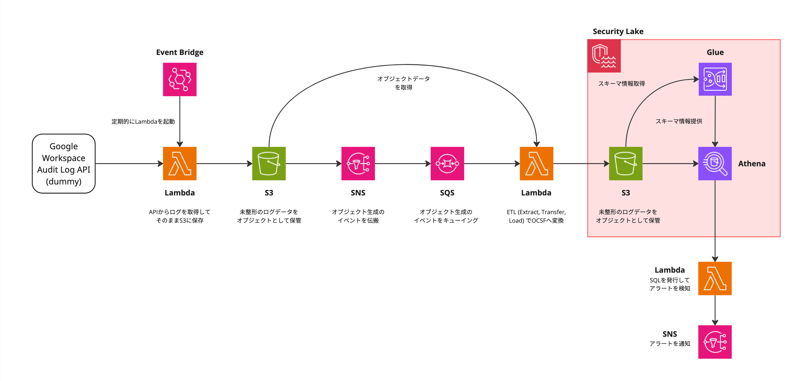

# Security Lake概要とデータスキーマ理解

**時間：9:45-10:15 (30分)**

この実習では、AWS Security Lakeを使用して実践的なセキュリティ監視基盤の一部を構築します。

### 学習目標
- セキュリティ監視のワークフローの一部を構築してみる
- セキュリティ監視の検知ルールを考え、実装してみる
- 無敗塾のシナリオを使った実践的学習を通じて、実務への応用力を身につける

## 実習環境のアーキテクチャ

### 全体構成



- Google Workspace の Audit Log API （dummy）から収集したログがAthenaに格納される
- Athenaに対してLambdaからSQLを発行し、セキュリティアラート（侵害と疑わしい事象）を検出する
- 検出されたアラートはSNSを通じて通知する
  - https://warren-171198963743.asia-northeast1.run.app/alerts に表示される

## Security Lakeとは

AWS Security Lakeは、セキュリティログを一元管理するためのマネージドデータレイクサービスです。

### 主な特徴

- **AWS各サービスのログを収集可能**
  - CloudTrail, VPC Flow Logs, DNS logs, etc...
- **OCSF（Open Cybersecurity Schema Framework）対応**
   - 業界標準のスキーマでログを標準化
   - 異なるソースのログを統一的に扱える
   - カスタムログソースに対応（50まで）
- **Parquet形式での効率的な保存**
   - 列指向フォーマットで高速クエリ
   - 圧縮による容量削減
- **Athenaとの統合**
   - SQLでログデータを分析
   - パーティショニングによる効率的な検索

## 処理フローの詳細

### ✅ ログ収集フェーズ

- Google Workspace APIからログを取得
- S3バケットにJSONL形式で保存

**ダミーAPIへのアクセス**
```
curl "https://b66hcc5aulnbshfnpuxofpzuxa0busxv.lambda-url.ap-northeast-1.on.aws/?startTime=2025-07-19T00:00:00Z&endTime=2025-07-19T00:05:00Z&offset=0&limit=2" | jq
```

**ログのフォーマット**
[log_format.md](log_format.md)

**Lambda**
https://ap-northeast-1.console.aws.amazon.com/lambda/home?region=ap-northeast-1#/functions/seccamp2025-b1-importer?tab=code

**Lambdaのコード**
https://github.com/m-mizutani/seccamp-2025-b1/blob/main/terraform/lambda/importer/main.go

**S3バケット**
https://ap-northeast-1.console.aws.amazon.com/s3/buckets/seccamp2025-b1-raw-logs?region=ap-northeast-1&bucketType=general&tab=objects

### ✅ 変換フェーズ

- S3イベントトリガーでConverter Lambdaが起動
- JSONL形式からOCSF Parquet形式に変換
- Security Lakeに標準化されたデータを格納

**Lambda**
https://ap-northeast-1.console.aws.amazon.com/lambda/home?region=ap-northeast-1#/functions/seccamp2025-b1-converter?tab=code

**Lambdaのコード**
https://github.com/m-mizutani/seccamp-2025-b1/blob/main/terraform/lambda/converter/main.go

**Security LakeのS3バケット**
https://ap-northeast-1.console.aws.amazon.com/s3/buckets/aws-security-data-lake-ap-northeast-1-bx7uskyh5pxj5xuil96uhdrfc?region=ap-northeast-1&tab=objects&bucketType=general

**Glueの実行結果**
https://ap-northeast-1.console.aws.amazon.com/glue/home?region=ap-northeast-1#/v2/data-catalog/tables/view/amazon_security_lake_table_ap_northeast_1_ext_google_workspace_1_0?database=amazon_security_lake_glue_db_ap_northeast_1&catalogId=145287089436&versionId=latest

### ☑️ 検知フェーズ

今日の実習のメインはここ

- 定期的にDetection Lambdaが実行（という想定）
- AthenaでSQLクエリを実行し異常を検知
- 検知結果をSNSで通知


### ✅ 対応フェーズ

- 通知されたSNSからアラートが生成される
- 今回のチケットシステム: https://warren-171198963743.asia-northeast1.run.app/alerts
- 具体的な対応はやらないが、対応に必要なプロセスは考えてもらう

### Security Lakeのデータ構造

```
aws-security-data-lake-{region}-{random}/
└── ext/
    └── google-workspace/
        └── 1.0/
            └── region={region}/
                └── accountId={accountId}/
                    └── eventDay={YYYYMMDD}/
                        └── *.parquet
```

## OCSFスキーマの理解

### OCSFとは

Open Cybersecurity Schema Framework（OCSF）は、セキュリティイベントを標準化するためのオープンな仕様です。
https://github.com/ocsf
https://schema.ocsf.io/

### 今回利用する主要なクラスとカテゴリ


- Category 6: Application Activity
- Class 6001: Web Resource Activity
- activity_id: アクティビティの種類
- actor: 実行者情報
- web_resources: 対象リソース

### Google WorkspaceログからOCSFへの変換例

対応表 [log_schema.md](./log_schema.md)

#### 元のGoogle Workspaceログ
```json
{
  "id": {"time": "2024-01-15T10:30:00Z"},
  "actor": {"email": "user@muhai-academy.com"},
  "events": [{
    "name": "download",
    "parameters": [{
      "name": "doc_title",
      "value": "機密学習データ_2024年度.xlsx"
    }]
  }]
}
```

#### OCSF形式への変換後
```json
{
  "activity_id": 7,  // Export
  "activity_name": "Export",
  "category_uid": 6,
  "class_uid": 6001,
  "severity_id": 2,  // Low
  "status_id": 1,    // Success
  "time": 1705315800000,
  "actor": {
    "user": {
      "email_addr": "user@muhai-academy.com",
      "uid": "user@muhai-academy.com"
    }
  },
  "api": {
    "operation": "download"
  },
  "web_resources": [{
    "name": "機密学習データ_2024年度.xlsx",
    "type": "spreadsheet"
  }]
}
```

### 重要なフィールドのマッピング

#### activity_id（アクティビティID）
- 1: Create（作成）
- 2: Read（読み取り）
- 3: Update（更新）
- 4: Delete（削除）
- 7: Export（エクスポート/ダウンロード）
- 8: Share（共有）

#### severity_id（重要度）
- 1: Informational（情報）
- 2: Low（低）
- 3: Medium（中）- 管理者操作など
- 4: High（高）- セキュリティ設定変更など

#### status_id（ステータス）
- 1: Success（成功）
- 2: Failure（失敗）- login_failure、access_deniedなど

## 実習で使用するツール

### AWS Athena
- Security Lake内のデータをSQLで検索
- パーティション分割による効率的なクエリ
- 結果はS3に保存される

### AWS Lambda
- Go言語で実装（ARM64アーキテクチャ）
- イベント駆動での実行
- CloudWatch Logsでのログ確認

## 次のステップ

Part 5では、実際にAthenaを使用してSecurity Lake内のデータを探索し、OCSFスキーマの理解を深めていきます。基本的なSQLクエリから始めて、徐々に複雑な分析へと進んでいきましょう。

### 準備事項
- AWSコンソールへのアクセス確認
- Athenaコンソールの場所確認
- Security Lakeテーブルの存在確認